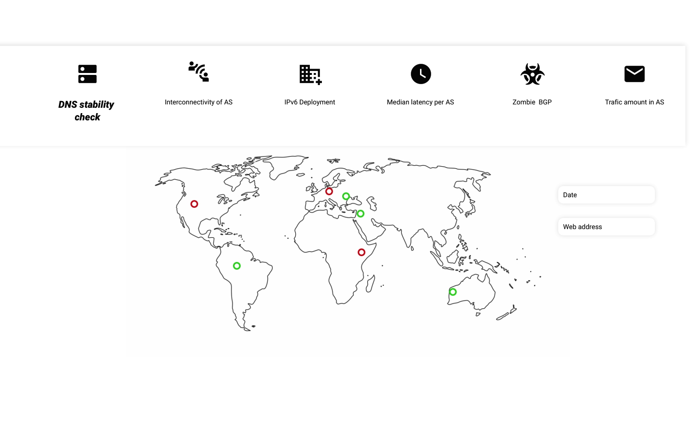
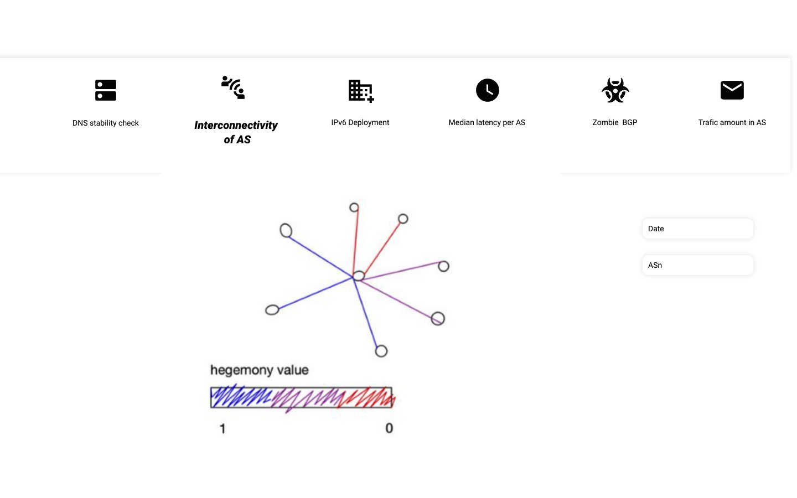
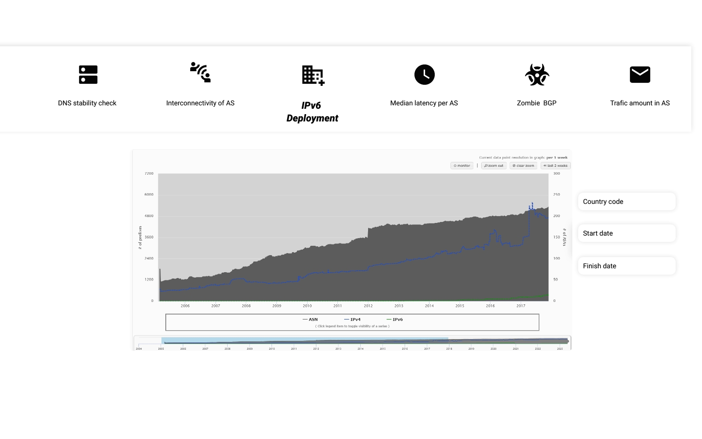
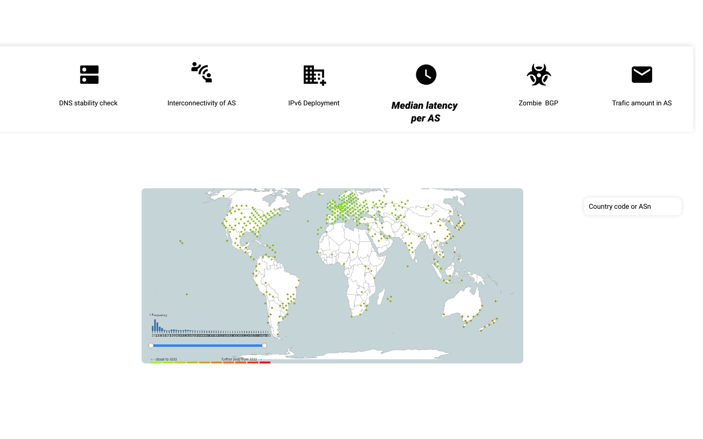
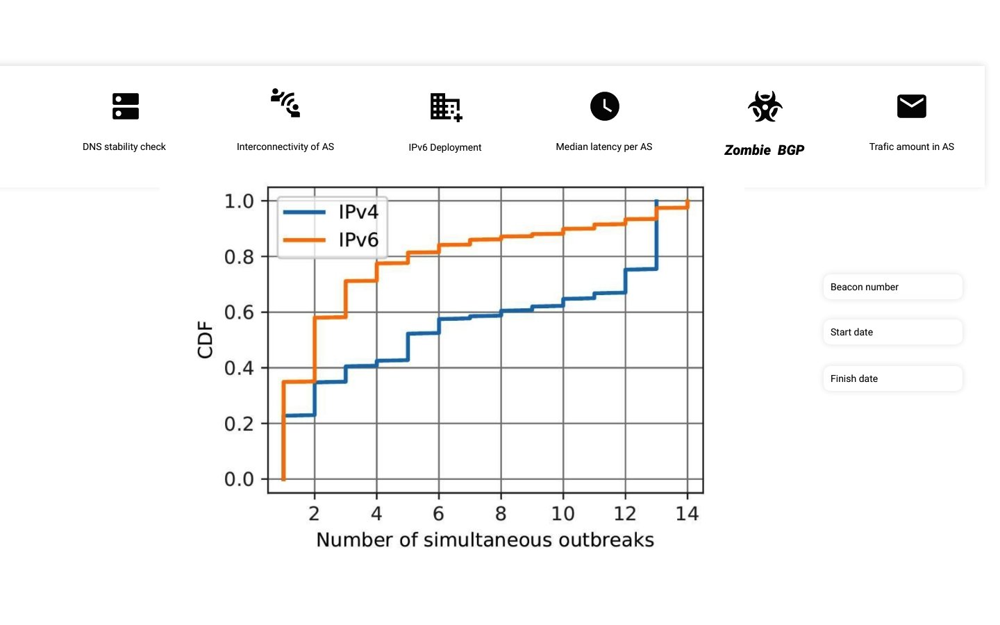
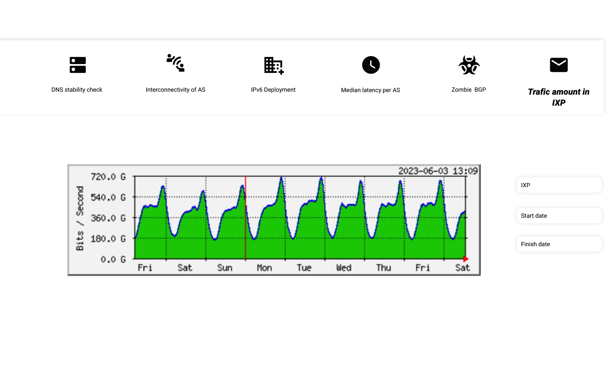

# NetworkProject-RAICAT
## General information about the project 
### System Architecture
The system builded from 3 main parts:
* Ripe Atlas - measurements database.
* Django - web server that will serve the GUI as API , and will enacpsulate the ripe atlas API calls for the fronend.
* React - frontend that will show the GUI to the user.
### Functional requirements 
* Modern web browser:
    * Chrome 60+
    * Firefox ESR + 
    * Safari 10.1+/iOS 10.1+
    * Edge 12+ 
    * Opera 47+
* Internet connection
* Installed python ≥ 3.11
#### Development requirements
* Node ≥ 14
### NON-Functional requirements(SKIP)
### Data Design(SKIP)
We don't use any database ,we will only use ripe atlas API , process it and send it to the frontend.
### Deployment and Infrastructure Design
All the system runs on localhost , no need for any external infrastructure. User only need to run a server and open the web page.
### User Interface Design

### System Components and Modules Design
* [Ripe Atlas Cousteau](https://ripe-atlas-cousteau.readthedocs.io/en/latest/) - python library that encapsulate the ripe atlas API requests.
* [Ripe Atlas Sagan](https://ripe-atlas-cousteau.readthedocs.io/en/latest/) - python library ,that encapsulate the ripe atlas API responses parcing and aggregation.
* [Django](djangoproject.com/start/) - python web server that will serve the GUI as API , and will enacpsulate the ripe atlas API calls for the fronend.Also will serve the frontend.
* [Python unittest module](https://docs.python.org/3/library/unittest.html) - for testing the server core components.
* [React](https://react.dev/) - frontend that will show the GUI to the user.
* [React-router](https://reactrouter.com/en/main) - routing library for react.
* [Redux](https://redux.js.org/) - state management library for react.
* [Redux Toolkit Query](https://redux-toolkit.js.org/) - powerful data fetching and caching library for react.
### Setup development stages
1. Create initial setup  
   1. Create django initial project
   2. Create react initial project using [create-react-app](https://create-react-app.dev/)
   3. Connect them together using [django-cra-helper](https://github.com/MasterKale/django-cra-helper)
2. UI setup
      1. Setup Redux
      2. Setup React-router
      3. Setup Redux Toolkit Query.
      4. Create basic UI for the main page , that will include chosing the usecase and showing the results of usecase.
## DNS stability check
### Overview and Purpose
To give to user possibility to check worldwide DNS stablity using GUI interface.
### User Interface Design

### Algorithms and System Logic
#### User story 
  1. user enters web page 
  2. user choses the date ( default - today )
  3. User see view with world map each country colored according DNS stability ( based on RTT from dns measurement of ripe atlas)
#### System logic
```mermaid
sequenceDiagram
    participant User
    participant Frontend
    participant Backend
    User->>Frontend: Enter web page

    User->>Frontend: Choose date (default - today) 
    Frontend->>Backend: Send request for data
    Backend->>Backend: Send GET request to ripe atlas API 
    
    Backend->>Backend: Aggregate results or throw error.
    
    Backend->>Frontend: Send data to frontend
    Frontend->>Frontend: Show data to user
```
### Testing
* Unit tests of all Server core components (Django), to ensure that the server works as expected.
* Manual testing of UI.
### Development stages
   1. Create basic server
      1. Create new API input.
           1. define url
           2. create function that will be connected to the url, and will return empty json
           3. Create basic test for the API input ,that tests connectivity of the function to the url.
        2.  Create function that given date will send the request to ripe atlas API and return the results or throws error in case of failure.
        3.  Create basic test for the function.
        4.  Create function that will use the previous function and sagan to aggregate the results.
        5.  Create basic test for the function.
   2. Create basic UI
      1. Add to dns usecase the ability to choose date(add date picker).
      2. Add World map component
      3. configure api call to the server.
      4. Add logic to the map component that will color the countries according to the results.
## Interconnectivity of AS
### Overview and Purpose
The Interconnectivity of AS use case aims to dynamically represent the state of interconnection between different Autonomous Systems (ASes) and the hegemony value of the connection. Users can also observe the change in interconnectivity over different dates. 
### User interface design

### Algorithms and System Logic
#### User story
1. User choose AS.
2. User chooses the date (default - today).
3. The user is presented with a graph that represents ASes as nodes and their connections as edges to visualize therouting between different ASes. The edge color will depend on hegemony value of the connection. 
https://observablehq.com/@tasos/depedency-timeseries?collection=@tasos/reusable-ihr-plots

#### System logic
```mermaid
sequenceDiagram
    participant User
    participant Frontend
    participant Backend
    User->>Frontend: Enter web page
    User->>Frontend: Choose date (default - today) or date range
    Frontend->>Backend: Send request for data
    Backend->>Backend: Send GET request to RIPE Atlas API
    Backend->>Backend: Retrieve and aggregate data
    Backend->>Frontend: Send data to frontend
    Frontend->>Frontend: Show graph to user
```
### Testing
* Unit tests of all Server core components (Django), to ensure that the server works as expected.
* Manual testing of UI.
### Development stages
1. Create basic server
   1. Create new API endpoints to handle AS interconnectivity requests.
           1. define url
           2. create function that will be connected to the url, and will return empty json
           3. Create basic test for the API input ,that tests connectivity of the function to the url.
   2. Implement functions to retrieve AS interconnectivity data from the RIPE Atlas API based on the selected date(s).
   3.  Perform necessary data aggregation and processing.
   4.  Create basic tests for the newly implemented server functionalities.
2. Create basic UI
      1. Provide the ability to select a date or date range, incorporating a date picker component.
      2. Develop the AS graph visualization component.
      3. Configure API calls to the server to retrieve AS interconnectivity data.

## IPv6 Deployment
### Overview and Purpose
The IPv6 Deployment use case aims to dynamically show users the state of IPv6 deployment worldwide. Users will be able to visualize the level of IPv6 routing in different countries based on the given date. 
### User Interface Design

### Algorithms and System Logic
#### User Story
1. User choose the country.
2. User enters the date range to observe the dynamic changes over time.
3. The user is presented with a graph that shows the level of IPv6 routing for the time range.
https://stat.ripe.net/specials/country-comparison

#### System Logic
```mermaid
sequenceDiagram
    participant User
    participant Frontend
    participant Backend
    User->>Frontend: Enter web page
    User->>Frontend: Choose date (default - today)
    Frontend->>Backend: Send request for data
    Backend->>Backend: Send GET request to RIPE Atlas API
    Backend->>Backend: Retrieve and aggregate data
    Backend->>Frontend: Send data to frontend
    Frontend->>Frontend: Show heatmap to user
```

### Testing
To ensure the proper functioning of the IPv6 Deployment use case, the following testing approach can be employed:
* Unit tests for all server core components (Django) to verify the expected behavior of the server.
* Manual testing of the user interface to ensure a seamless and intuitive user experience.

### Development Stages
The development stages for the IPv6 Deployment use case can be summarized as follows:
1. Expand the server functionality
   1. Create new API endpoints to handle IPv6 deployment requests.
   2. Implement functions to retrieve IPv6 deployment data from the RIPE Atlas API based on the selected date(s).
   3. Perform necessary data aggregation and processing.
   4. Create basic tests for the newly implemented server functionalities.
2. Enhance the user interface
   1. Provide the ability to select a date, incorporating a date picker component.
   2. Develop the graph component.
   3. Configure API calls to the server to retrieve IPv6 deployment data.

## Analysis of Network Latency Worldwide
### Overview and Purpose
The Analysis of Network Latency Worldwide use case aims to provide users with information about the median latency between a given Autonomous System Number (ASN) and other ASNs worldwide for a specific date. Users will be able to visualize network latency on a worldwide map, with red rods indicating high latency and green dots representing low latency.

### User Interface Design

### Algorithms and System Logic
#### User Story
1. User enters the ASN or country.
2. User selects the date.
3. The user is presented with a worldwide map indicating the network latency between the selected ASN or country and other ASNs worldwide.

#### System Logic
```mermaid
sequenceDiagram
    participant User
    participant Frontend
    participant Backend
    User->>Frontend: Enter web page
    User->>Frontend: Enter ASN or country
    User->>Frontend: Choose date
    Frontend->>Backend: Send request for data
    Backend->>Backend: Send GET request to RIPE Atlas API
    Backend->>Backend: Retrieve and aggregate data
    Backend->>Frontend: Send data to frontend
    Frontend->>Frontend: Show latency visualization to user
```

### Testing
To ensure the proper functioning of the Analysis of Network Latency Worldwide use case, the following testing approach can be employed:
* Unit tests for all server core components (Django) to verify the expected behavior of the server.
* Manual testing of the user interface to ensure a seamless and intuitive user experience.

### Development Stages
The development stages for the Analysis of Network Latency Worldwide use case can be summarized as follows:
1. Expand the server functionality
   1. Create new API endpoints to handle network latency analysis requests.
   2. Implement functions to retrieve network latency data from the RIPE Atlas API based on the selected ASN or country and date.
   3. Perform necessary data aggregation and processing.
   4. Create basic tests for the newly implemented server functionalities.
2. Enhance the user interface
   1. Provide input fields for users to enter the ASN or country and select the date.
   2. Develop the worldwide map component.
   3. Configure API calls to the server to retrieve network latency data.

## Zombie BGP
### Overview and Purpose
The Zombie BGP use case aims to show the frequency of zombie appearances. Zombies are BGP announcements that reappear after being withdrawn. Users will be able to compare the occurrence of zombie outbreaks between two different dates. The data will be normalized by the number of times beacons have been withdrawn during our measurement study.

### User Interface Design

### Algorithms and System Logic
#### User Story
1. User enters the beacon.
2. User selects the date for comparing 1 and date for comparing 2.
3. The program calculates the number of outbreaks that occurred simultaneously but on different dates, normalized by the number of times beacons have been withdrawn during the measurement study.
4. The GUI displays a graph with the CDF dimension and the number of simultaneous outbreaks.

#### System Logic
```mermaid
sequenceDiagram
    participant User
    participant Frontend
    participant Backend
    User->>Frontend: Enter web page
    User->>Frontend: Enter beacon, date for comparing 1, and date for comparing 2
    Frontend->>Backend: Send request for data
    Backend->>Backend: Perform calculations based on the given inputs
    Backend->>Frontend: Send data to frontend
    Frontend->>Frontend: Show graph with CDF dimension and number of simultaneous outbreaks to user
```

### Testing
To ensure the proper functioning of the Zombie BGP use case, the following testing approach can be employed:
* Unit tests for all server core components (Django) to verify the expected behavior of the server.
* Manual testing of the user interface to ensure a seamless and intuitive user experience.

### Development Stages
The development stages for the Zombie BGP use case can be summarized as follows:
1. Expand the server functionality
   1. Create new API endpoints to handle Zombie BGP requests.
   2. Implement functions to calculate the number of simultaneous outbreaks based on the given inputs.
   3. Perform necessary data normalization and processing.
   4. Create basic tests for the newly implemented server functionalities.
2. Enhance the user interface
   1. Provide input fields for users to enter the beacon, date for comparing 1, and date for comparing 2.
   2. Develop the graph component with the CDF dimension and the number of simultaneous outbreaks.
   3. Configure API calls to the server to retrieve Zombie BGP data.

## Traffic Flow in IXPs
### Overview and Purpose
The Traffic Flow in IXPs use case aims to analyze the amount of traffic in Internet Exchange Points (IXPs) over a specific time period. By plotting a graph that depicts the dependency of traffic on dates, users can gain insights into the patterns and fluctuations of traffic within the selected IXP.

### User Interface Design

### Algorithms and System Logic
#### User Story
1. User enters the IXP, start date, and finish date.
2. The program retrieves the traffic data for the specified IXP and time range.
3. The GUI displays a graph showing the amount of traffic as a dependency on dates.

#### System Logic
```mermaid
sequenceDiagram
    participant User
    participant Frontend
    participant Backend
    User->>Frontend: Enter web page
    User->>Frontend: Enter IXP, start date, and finish date
    Frontend->>Backend: Send request for traffic data
    Backend->>Backend: Retrieve traffic data for the specified IXP and time range
    Backend->>Frontend: Send traffic data to frontend
    Frontend->>Frontend: Generate graph with time and amount of traffic dimensions
    Frontend->>Frontend: Display graph to user
```

### Testing
To ensure the proper functioning of the Traffic Flow in IXPs use case, the following testing approach can be employed:
* Unit tests for all server core components (Django) to verify the expected behavior of the server.
* Manual testing of the user interface to ensure a seamless and intuitive user experience.

### Development Stages
The development stages for the Traffic Flow in IXPs use case can be summarized as follows:
1. Expand the server functionality
   1. Create new API endpoints to handle traffic data requests for specific IXPs and time ranges.
   2. Implement functions to retrieve the relevant traffic data from the database based on the given inputs.
   3. Perform any necessary data preprocessing or filtering.
   4. Create basic tests for the newly implemented server functionalities.
2. Enhance the user interface
   1. Provide input fields for users to enter the IXP, start date, and finish date.
   2. Develop the graph component with the dimensions of time and amount of traffic.
   3. Configure API calls to the server to retrieve traffic data for the selected IXP and time range.
   4. Display the generated graph to the user in the GUI.